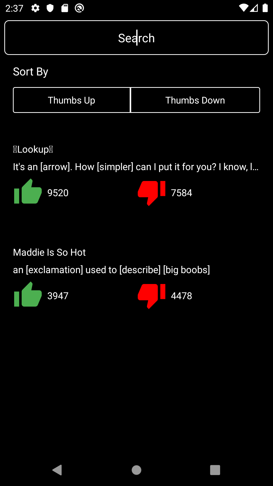
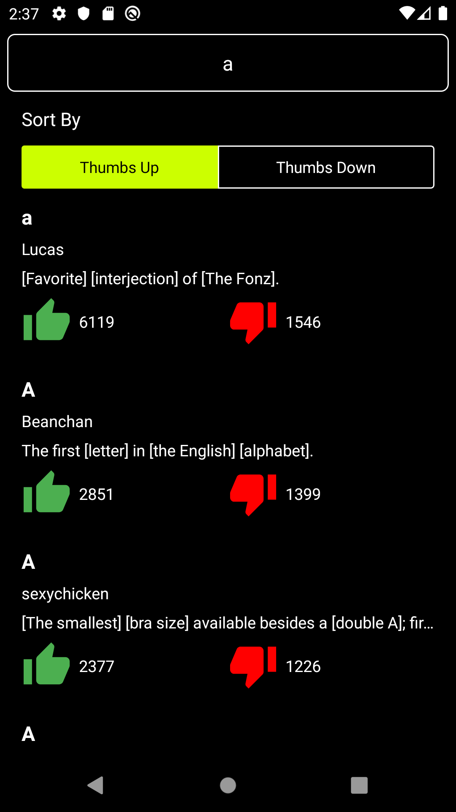

# Urbandictionary Kotlin
This is demo application creating Urban Dictionary. 
I have used some of the technologies listed below: 
  1- Retrofit for API calls to search dictionary words 
  2- MVVM design pattern 
  4- RecyclerView to show the data in list 

   

